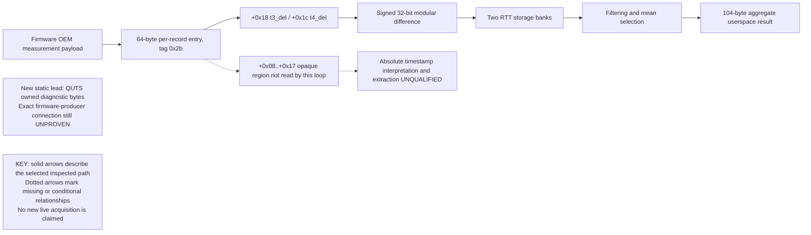

# Qualifying the TSF, FTM and host-clock relationships

> **Archive — not current operating instructions.** Historical documentation at [e9d71b843651](https://github.com/Protonmatter/wifi-hardware-time/commit/e9d71b84365122ff2640e240b20fc1dbb834388a). Relative links are rebased for reading. [Exact original bytes](../originals/docs__clock-models__clock-relationship-investigation.md.txt) · [Archive index](../README.md) · [Current research](../../../docs/research-history/README.md).

This investigation tests whether the exposed ranging and counter values can determine clock relationships. Saved records reproduce the driver’s arithmetic, but aggregated ranging intervals cannot identify clock offset. Counter models can fit some observations only under unproven sampling assumptions, so their numerical agreement does not qualify a usable hardware-to-host conversion.

<!-- historical-context:2026-10-04 -->
**Historical context (2026-10-04):** QUTS and QXDM expose distinct hardware-origin, interpolated and host-delivery times. Owned bytes do not establish fresh hardware-to-QPC sampling or an accuracy bound. See [current findings](https://github.com/Protonmatter/wifi-hardware-time/blob/e9d71b84365122ff2640e240b20fc1dbb834388a/docs/knowledge/current-findings.md).
<!-- /historical-context -->

**Key terms:** Clock offset is the difference between two clocks. An affine model uses a rate and offset. A sampling bracket must contain the actual measurement instant, not merely the delivery of a cached value. See the [glossary](https://github.com/Protonmatter/wifi-hardware-time/blob/e9d71b84365122ff2640e240b20fc1dbb834388a/docs/glossary.md).

## Contents

- [1. The earlier FTM transformation is now identified](#1-the-earlier-ftm-transformation-is-now-identified)
- [2. Saved evidence confirms the arithmetic](#2-saved-evidence-confirms-the-arithmetic)
- [3. Why the available deltas cannot identify clock offset](#3-why-the-available-deltas-cannot-identify-clock-offset)
- [4. Test a specific SoC-to-QPC hypothesis](#4-test-a-specific-soc-to-qpc-hypothesis)
- [5. Relationship ledger](#5-relationship-ledger)
- [6. Reproduce and continue](#6-reproduce-and-continue)

Status: offline exact-build investigation and saved-capture replay. No new private
request, FTM exchange, register operation, driver change or clock adjustment was
performed. Existing diagram/design changes remain separate from these findings.

Binary inspected: ARM64 `qcwlanhmt8380.sys` 1.0.4374.1300, SHA-256
`ca884ce1a22113194f3c467f36abc39afb0c137e5a7a8e2697420438b21e4115`.
RVAs identify this file only; they are not callable userspace interfaces.

## 1. The earlier FTM transformation is now identified

The firmware OEM response handler at RVA `0x1477f0` accepts the measurement
response subtype and reassembles its payload. At `0x147a88` it calls
`handle_merged_event`, identified at `0x146ef0` by its diagnostic string.

That parser steps through fixed 64-byte per-record entries. The key path is:

| RVA / record offset | Verified behavior |
|---|---|
| `0x147148`–`0x147160` | Advance by `0x40` bytes and check tag `0x2b` |
| Record `+0x18` | Read/log unsigned value named `t3_del` |
| Record `+0x1c` | Read/log unsigned value named `t4_del` |
| `0x147184`–`0x14718c` | Load both words, subtract `t4_del - t3_del` in 32 bits, store result |
| Record `+0x20`, bits 16–19 | Select one of two internal RTT storage banks; do not confuse these with Wi-Fi channel numbers |
| `0x1471bc`–`0x14722c` | Log operands and signed result |
| `0x1462a0` | Later filter, aggregate and construct the WDI result, as previously analyzed |



This establishes a reduction from a pair of input values into each RTT sample,
before the already documented mean/array selection. It does not establish that
the two operands are absolute event times or that the entire firmware response
contains only deltas.

The 16 bytes at record offsets `+0x08..+0x17` are **not consumed by the inspected
per-record loop**. They are a concrete investigation target, but their names,
population, units and clock domain remain unqualified. Layouts from other
products cannot establish the installed Windows firmware contract. No raw
record containing those bytes has been obtained through the current callback.

## 2. Saved evidence confirms the arithmetic

The new offline extractor selects only the recognized numeric `t3_del`, `t4_del`
and `rtt` log fields. It checks saved build metadata, trace-loss/decoder status,
and provider-event counts against the independent native decoder. The Python
analyzer requires ordered same-thread triplets and exact signed-32-bit subtraction.
It rejects partial/duplicate/reordered groups, inconsistent arithmetic and loss.
The extractor rejects malformed messages for any target field instead of silently
skipping them. Regression cases cover malformed intermediate and trailing groups,
which could otherwise let fields from different records form a false triplet.
Field recognition is case-sensitive for this exact build: its uppercase
`RTT report` heading is not the lowercase numeric `rtt` field.

| Saved capture | Matched log triplets |
|---|---:|
| `WifiFtm-83d68ef1a7aa` | 21/21 |
| `WifiFtm-89003fb1ba0a` | 22/22 |
| `WifiFtm-43963cbc551c` | 8/8 |
| Total | 51/51 |

Example: `80307643 - 80301671 = 5972`. These are raw numeric fields. Their numerical
propagation to the RTT result does not establish an absolute event-time unit,
clock epoch, physical reference point or calibrated accuracy. A logged triplet
is not necessarily a distinct successful RF exchange; per-chain records,
placeholder values and later filtering must remain separate.

The selected captures are the same three used for the earlier ten-callback
aggregation replay. Their ETL hashes are recorded in [FTM result provenance](https://github.com/Protonmatter/wifi-hardware-time/blob/e9d71b84365122ff2640e240b20fc1dbb834388a/docs/ftm/ftm-result-provenance.md).
This pass does not match every pre-filter record to an over-the-air frame/token.

## 3. Why the available deltas cannot identify clock offset

For a hypothetical matched two-sided exchange, changing B's constant clock offset
changes both B event timestamps by the same amount. It leaves the B turnaround
interval unchanged; A's roundtrip interval is unchanged too. Consequently their
difference can be identical for different clock offsets.

A synthetic test explicitly constructs two distinct offsets with the same pair
of intervals and RTT. This is an identifiability result, not an accuracy test.
Neither fitting a smoother mean nor retaining more aggregate RTT samples restores
the missing absolute relationship. Raw event times and their clock semantics, or
another independently qualified mapping, are required.

## 4. Test a specific SoC-to-QPC hypothesis

Use only the 18 action-4 observations from the six mixed campaign runs. Action-3
SoC values are cached/unknown and are excluded from fresh-pair hypotheses.

Hypothesis H0: one SoC raw tick equals exactly 10 QPC ticks, with one constant
offset, and the SoC sample lies between host request start and report logging.
For each observation, that hypothesis implies an interval for the offset:

```text
b in [host_before - 10*SoC, host_report - 10*SoC]
```

Those intervals have an empty intersection in **all six runs individually**.
Thus the conjunction of nominal scale, constant offset and assumed fresh sampling
does not explain the observations. This does not identify which assumption fails.

Allowing an affine rate, H = a*S+b, admits a candidate in all six runs. Exact
rational pairwise constraints give the following conditional slope ranges:

| Run | Nominal-model gap (QPC ticks) | Conditional affine slope range (QPC ticks / SoC raw tick) |
|---|---:|---|
| idle-mixed-1 | 3649 | 10.0001507–10.0005567 |
| idle-mixed-2 | 6880 | 10.0002746–10.0004736 |
| idle-mixed-3 | 5666 | 10.0002339–10.0005774 |
| workload-mixed-1 | 4925 | 10.0002036–10.0005911 |
| workload-mixed-2 | 4342 | 10.0001784–10.0005255 |
| workload-mixed-3 | 6035 | 10.0002491–10.0005888 |

An exploratory combination of all 18 points, additionally assuming one continuous
affine relation across capture boundaries, admits a slope of approximately
10.0003721–10.0003838. The CLI deliberately analyzes one capture at a time; the
combined result is not a qualified cross-epoch conversion.

The reported TSF-minus-SoC difference also varies: its range spans 3407 raw units
across those 18 observations. Do not treat the two reported counters as one clock
plus a fixed offset. The observations alone cannot separate rate differences,
resynchronization effects and unequal sampling positions.

**Feasibility is not a cross timestamp.** The windows used here are observed host
windows, not proven hardware-sampling brackets. A constant sampling bias can
move the apparent offset without spoiling the fit. The tool therefore always
returns `fresh_sampling_validated: false`, `conversion_qualified: false` and null
external uncertainty, including when the affine model is feasible.

## 5. Relationship ledger

| Relationship | Established | Missing before clock use |
|---|---|---|
| FTM input delta pair → per-record RTT | Exact-build subtraction; 51 saved triplets agree | Absolute event times, physical units/reference semantics, frame/token binding |
| RTT banks → callback aggregate | Previous exact-build model matches 10 callbacks | Aggregate cannot recover lost offset information; variance remains unqualified |
| SoC → QPC | Nominal fixed-rate hypothesis rejected; affine candidate consistent under assumptions | Fresh sampling bracket and qualified rate/offset error |
| TSF → SoC | Action-dependent reports; difference is not constant | Simultaneity, counter units, epoch and clock-domain relationship |
| FTM event clock → TSF | No qualified relationship | Actual event values and an independently established mapping |
| Arbitrary packet event clock → QPC | No working export demonstrated on this build | Supported timestamp path, packet identity and cross-clock mapping |

## 6. Reproduce and continue

All commands below are offline, with no elevation or device operations:

```powershell
powershell.exe -NoProfile -File research/ftm/Export-FtmDeltaEvents.ps1 -RunDirectory artifacts/WifiFtm-<run> -OutputPath artifacts/<new-delta-evidence>.json
python research/ftm/analyze_ftm_deltas.py artifacts/<new-delta-evidence>.json --output artifacts/<new-analysis>.json
python research/clock_models/analyze_clock_pairing_hypothesis.py artifacts/QualcommCampaign-<run>/<phase>-mixed-<n>/evidence.json
python -m unittest discover -s tests -p test_ftm_delta_relationship.py -v
python -m unittest discover -s tests -p test_ftm_delta_log_parser.py -v
python -m unittest discover -s tests -p test_clock_pairing_hypothesis.py -v
```

Use new output filenames; existing files are not replaced. Exit 0 means completed
extraction/arithmetic analysis, 1 means rejected evidence or I/O failure; Python
argument syntax errors use 2. A false hypothesis is a valid analysis result,
not a tool execution failure. Source metadata/hashes provide local provenance,
not authentication. Keep trace-derived outputs private. No rollback is needed.

Local validation after the parser review fix: 69 research unit tests passed,
including the locally owned exact-driver fixture and Windows PowerShell parser
regressions; Python compilation and PowerShell syntax checks passed. All three
ETLs were re-extracted with the strict parser and reproduced 21, 22 and 8 matching
triplets. The hypothesis CLI reproduced the table above from the six individual
capture bundles. The downstream contract's eight tests also passed. These are
offline checks, not a new hardware qualification campaign or hosted-CI result.

Next hardware-access decision: seek a supported raw measurement report or vendor
contract for the pre-aggregation record. Establish whether the opaque region
contains meaningful event times before designing a return API. A kernel debugger,
driver patch, diagnostic-state change or arbitrary memory read is not authorized
or introduced by these offline tools. In parallel, qualify the fresh SoC/TSF
sampling point relative to QPC; no amount of affine fitting supplies that proof.
