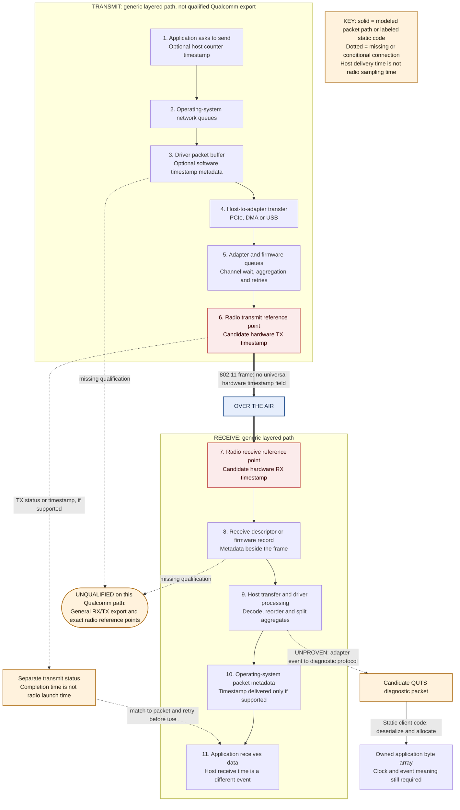
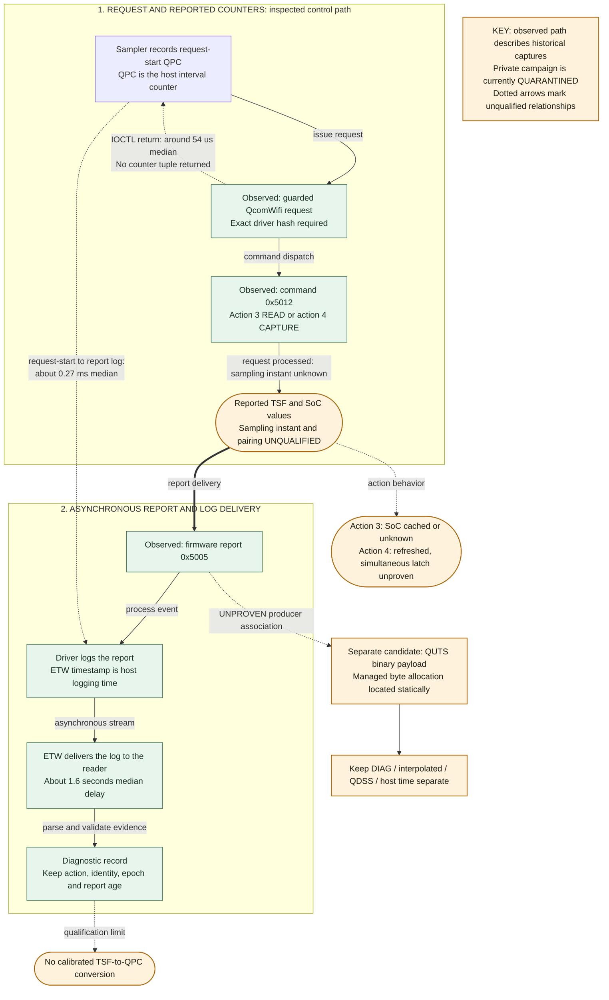
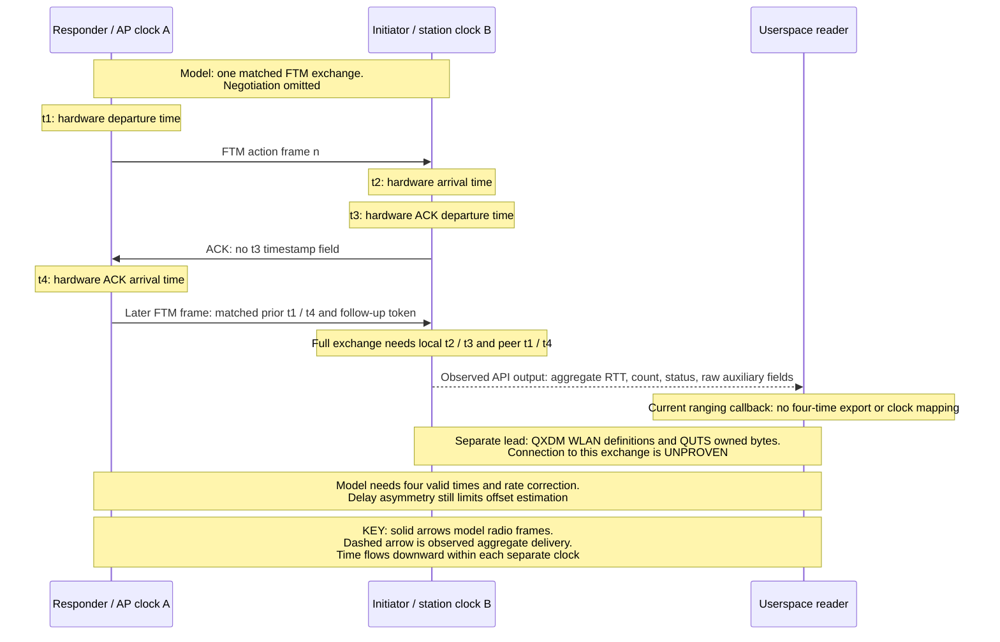
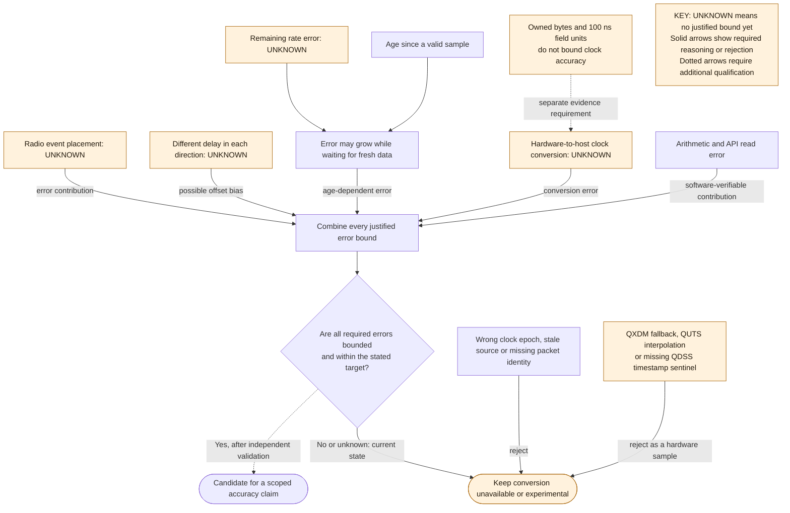
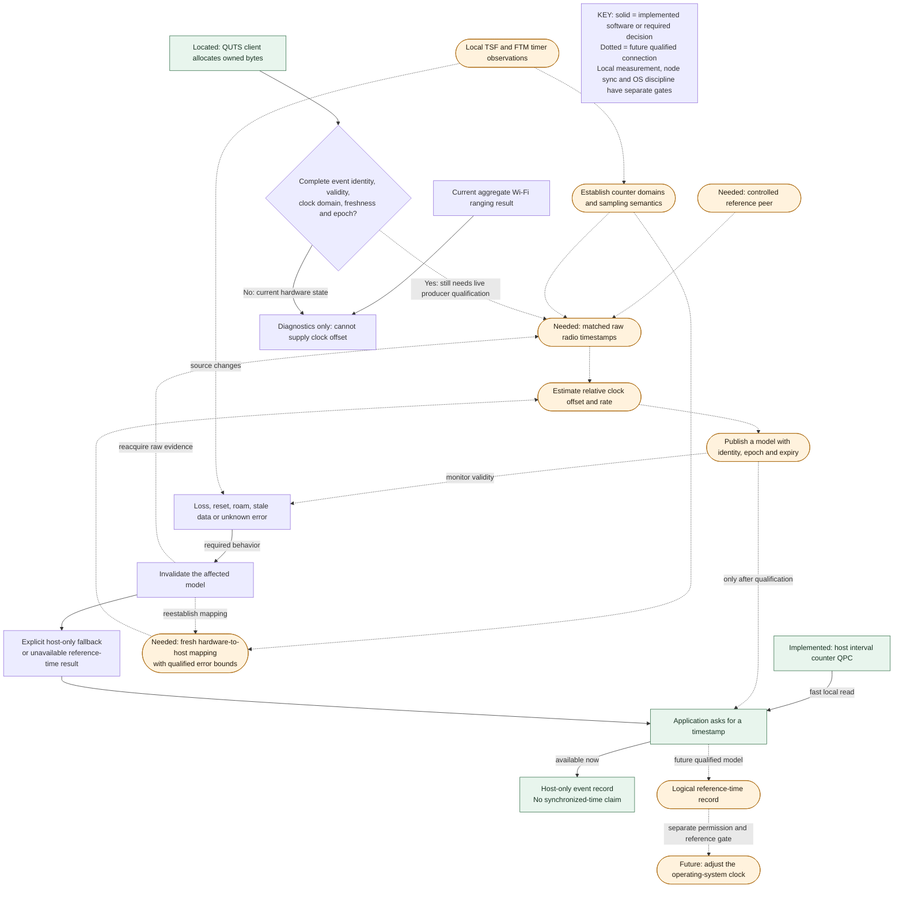
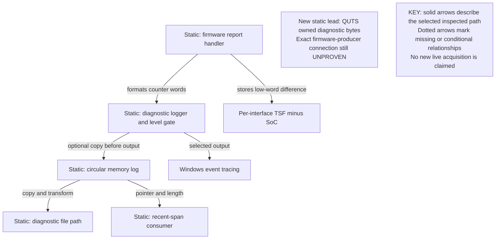
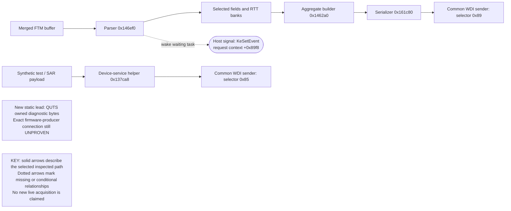
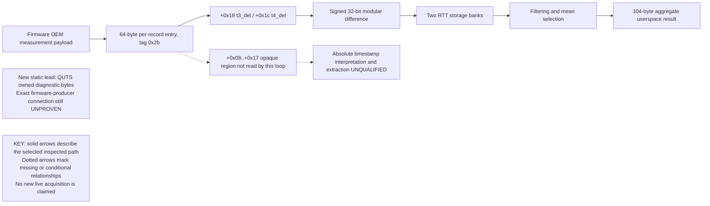
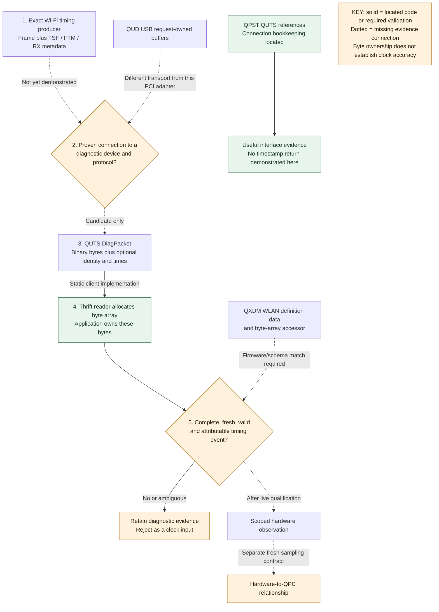

# Research workflow diagrams

> **Archive — not current operating instructions.** Historical documentation at [da4f55e48a36](https://github.com/Protonmatter/wifi-hardware-time/commit/da4f55e48a368f59ed68ee4427013a83b5c06070). Relative links are rebased for reading. [Exact original bytes](../originals/docs__knowledge__workflow-diagrams.md.txt) · [Archive index](../README.md) · [Current research](../../../docs/research-history/README.md).

These diagrams show where timing values originate, where software copies them and which connections still need evidence. Follow the labeled arrows and legends: modeled radio behavior, observed historical paths and statically inspected client code are different kinds of evidence. The vendor-return diagram makes the unresolved adapter-to-QUTS connection explicit.

## Contents

- [Interactive Archify Studio HTML](https://github.com/Protonmatter/wifi-hardware-time/blob/da4f55e48a368f59ed68ee4427013a83b5c06070/docs/overview/archify-studio/index.html) and [SVG gallery/guide](https://github.com/Protonmatter/wifi-hardware-time/blob/da4f55e48a368f59ed68ee4427013a83b5c06070/docs/overview/archify-studio/README.md): ten source-linked views covering acquisition, I/O ownership, clock models, evidence and open hardware gates. Download the HTML and open it locally for interactive use.
- [Persistent TSF Archify views](https://github.com/Protonmatter/wifi-hardware-time/blob/da4f55e48a368f59ed68ee4427013a83b5c06070/docs/overview/archify-tsf/README.md): system layers, workflow, lifecycle, time sources, timestamp sequence, algorithms and live/offline adapters.
- [Packet path](#packet-path)
- [Private TSF reports](#private-tsf-reports)
- [Four-event FTM model](#four-event-ftm-model)
- [Uncertainty and rejection](#uncertainty-and-rejection)
- [Application adoption](#application-adoption)
- [Reports versus memory ring](#reports-versus-memory-ring)
- [FTM notification routing](#ftm-notification-routing)
- [FTM reduction](#ftm-reduction)
- [Vendor return candidates](#vendor-return-candidates)

## Packet path

Source: [packets-timestamp-path.mmd](https://github.com/Protonmatter/wifi-hardware-time/blob/da4f55e48a368f59ed68ee4427013a83b5c06070/docs/clock-models/diagrams/packets-timestamp-path.mmd).

## Private TSF reports

Source: [qualcomm-timestamp-path.mmd](https://github.com/Protonmatter/wifi-hardware-time/blob/da4f55e48a368f59ed68ee4427013a83b5c06070/docs/tsf/diagrams/qualcomm-timestamp-path.mmd).

## Four-event FTM model

Source: [ftm-timestamp-path.mmd](https://github.com/Protonmatter/wifi-hardware-time/blob/da4f55e48a368f59ed68ee4427013a83b5c06070/docs/ftm/diagrams/ftm-timestamp-path.mmd).

## Uncertainty and rejection

Source: [uncertainty-timestamp-path.mmd](https://github.com/Protonmatter/wifi-hardware-time/blob/da4f55e48a368f59ed68ee4427013a83b5c06070/docs/clock-models/diagrams/uncertainty-timestamp-path.mmd).

## Application adoption

Source: [adoption-timestamp-path.mmd](https://github.com/Protonmatter/wifi-hardware-time/blob/da4f55e48a368f59ed68ee4427013a83b5c06070/docs/evidence/diagrams/adoption-timestamp-path.mmd).

## Reports versus memory ring

Source: [report-vs-ring.mmd](https://github.com/Protonmatter/wifi-hardware-time/blob/da4f55e48a368f59ed68ee4427013a83b5c06070/docs/memory-ring/diagrams/report-vs-ring.mmd).

## FTM notification routing

Source: [notification-routing.mmd](https://github.com/Protonmatter/wifi-hardware-time/blob/da4f55e48a368f59ed68ee4427013a83b5c06070/docs/ftm/diagrams/notification-routing.mmd).

## FTM reduction

Source: [ftm-reduction.mmd](https://github.com/Protonmatter/wifi-hardware-time/blob/da4f55e48a368f59ed68ee4427013a83b5c06070/docs/clock-models/diagrams/ftm-reduction.mmd).

## Vendor return candidates

Source: [vendor-return-paths.mmd](https://github.com/Protonmatter/wifi-hardware-time/blob/da4f55e48a368f59ed68ee4427013a83b5c06070/docs/adapters/diagrams/vendor-return-paths.mmd).

