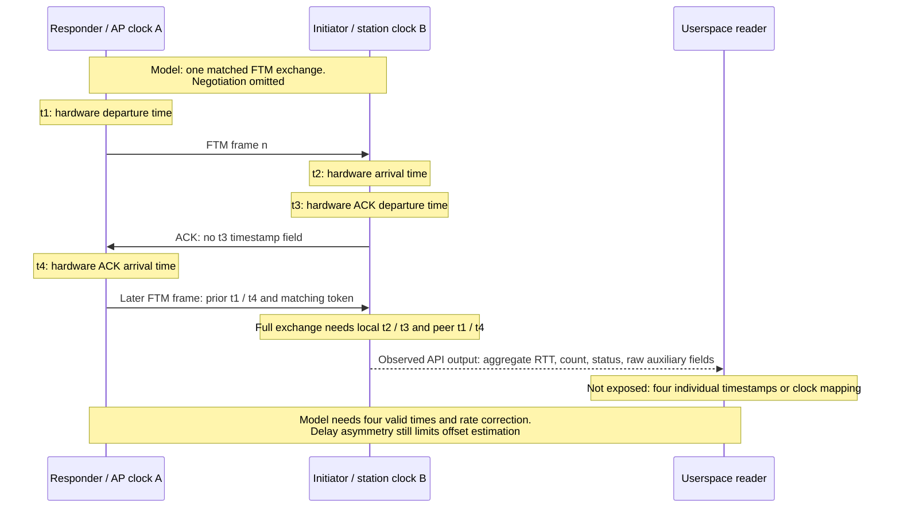

# Wi-Fi ranging results and raw timestamp limits

Can Wi-Fi ranging supply the four timestamps needed to compare clocks? Saved results and driver analysis explain aggregate ranging output and identify an earlier internal measurement buffer. No supported export of the four absolute event times is established. Successful ranging therefore does not qualify clock offset, timestamp accuracy, or general packet timing.

FTM (Fine Timing Measurement) is a Wi-Fi ranging exchange. RTT is round-trip time; an ACK is a frame acknowledging receipt. An aggregate combines several measurements into one result. See the [glossary](../glossary.md).

## Reports

| File | Question answered |
|---|---|
| [ftm-result-provenance.md](ftm-result-provenance.md) | Why can a successful callback contain zero measurements, and why is its variance field unqualified? |
| [ftm-raw-access-followup.md](ftm-raw-access-followup.md) | What exists before aggregation, and which export contract is still missing? |
| [ftm-notification-routing.md](ftm-notification-routing.md) | Do the inspected notification or completion routes carry that raw buffer? |

## Four-event model versus observed output

This simplified model identifies the times a full exchange needs. It does not claim the current callback exposes them. Source: [ftm-timestamp-path.mmd](diagrams/ftm-timestamp-path.mmd).

Diagram key: solid arrows are modeled radio frames; the dashed arrow is the observed application result. Notes labeled **Model**, **Observed API output**, and **Not exposed** distinguish assumptions, findings, and limits without relying on color. Time labels belong to the local clock shown above each participant. Unequal delay in the two directions still limits clock-offset estimates even when all four times are available.

## Research tools

- [ftm_once.c](../../research/ftm/ftm_once.c) and [ftm_result.h](../../research/ftm/ftm_result.h): exact-build request and callback layout.
- [Capture-FtmOnce.ps1](../../research/ftm/Capture-FtmOnce.ps1): bounded ranging capture workflow.
- [decode_ftm_response.py](../../research/ftm/decode_ftm_response.py): aggregate callback decoding.
- [FtmDeltaLog.ps1](../../research/ftm/FtmDeltaLog.ps1) and [Export-FtmDeltaEvents.ps1](../../research/ftm/Export-FtmDeltaEvents.ps1): logged time-difference extraction.
- [analyze_ftm_deltas.py](../../research/ftm/analyze_ftm_deltas.py): saved delta analysis.
- [model_ftm_selection.py](../../research/ftm/model_ftm_selection.py): pure offline model of result selection and aggregation.

Live tool availability does not qualify raw timestamp access or ranging accuracy. Return to the [documentation index](../README.md).
