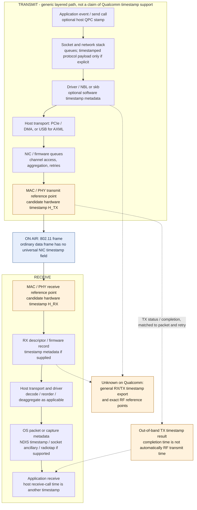
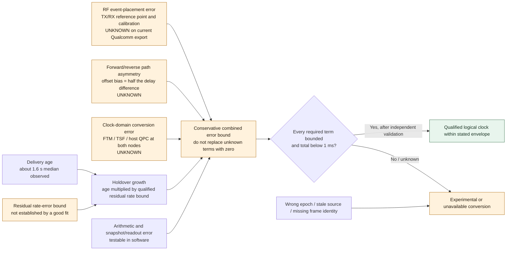
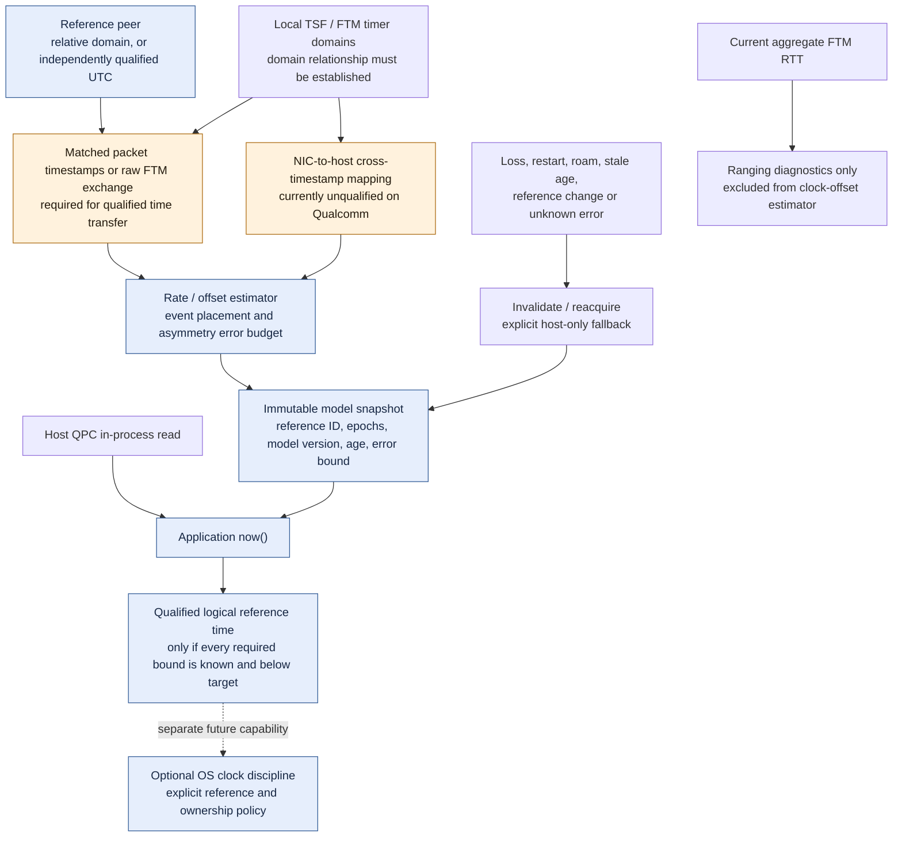

# Packet-to-clock timestamp map and uncertainty ledger

Status: research map and design input, not a declaration of new hardware support.
The active Qualcomm driver is qualified only by its exact recorded hash. The
Linux AXML branches below are pinned-source findings, not live hardware results.

Exact-build follow-up: [RX descriptor and ring findings](qualification/timing-boundary-investigation-2026-10-03.md)
locate the PPDU diagnostic high/low words at descriptor +0x60/+0x68. Their units,
validity, clock domain, live packet identity and userspace delivery remain open;
no arrow in the generic diagrams below should be read as a newly working export.

**Legend:** green in the Qualcomm view marks the observed report path; amber
marks unresolved semantics/capabilities; blue marks generic or proposed paths.
The generic packet diagram describes where timestamps can exist, not which
features this Qualcomm driver exposes.

## 1. Ordinary packet TX and RX



A simplified ordinary Wi-Fi data transmission is:

```text
ON AIR
[PHY preamble / signaling]
[802.11 MAC header: addresses, Duration/ID, sequence/control fields ...]
[frame body: protocol payload, possibly protected/aggregated]
[FCS]

AT A HOST CAPTURE INTERFACE, IF SUPPORTED
[capture-record timestamp]
[radiotap metadata, possibly including local RX timing]
[802.11 frame bytes, with capture-specific stripping/presentation]
```

The second wrapper is not transmitted over the air. A data protocol such as
PTP/NTP can explicitly carry timing information in its payload; ordinary data
frames have no universal NIC TX/RX timestamp field. Duration/ID and sequence
control are not wall-clock event timestamps. Header size, encryption and
aggregation vary; this is not a byte-offset parser specification.

Hardware timestamping should identify a precise transmit/receive reference point.
A host send call, NIC submission, medium access, RF transmission, ACK reception
and completion notification are different events. Retries can create multiple
transmission attempts for one higher-level packet. Packet association must retain
direction, relevant packet/token identity, link/vdev, retry/aggregation context
and clock epoch.

The Linux socket API reports timestamps through ancillary metadata; hardware TX
results are asynchronous and normally read from the error queue. TX completion
time is a distinct event from physical TX time. [Linux timestamping documentation](https://docs.kernel.org/networking/timestamping.html).

Windows can attach a raw hardware clock value or a software QPC timestamp to
NET_BUFFER_LIST metadata. Capability/configuration and the driver's event-point
corrections matter; existence of the framework does not qualify this adapter.
[NDIS packet timestamp attachment](https://learn.microsoft.com/en-us/windows-hardware/drivers/network/attaching-timestamps-to-packets).

## 2. Where each timestamp actually lives

| Quantity | On the air? | Location / domain | What remains to establish |
|---|---|---|---|
| Application send/receive stamp | Only if the application explicitly serializes it | Host application record, usually host-monotonic or wall-time domain | Event definition and host-to-reference relation |
| Beacon/probe-response Timestamp | Yes | 64-bit Timestamp in management-frame body; sender/AP TSF domain | Match to local RX point, AP identity/epoch, physical reference position and any UTC relation |
| Ordinary packet RX/TX hardware stamp | Usually no | NIC descriptor, firmware report, driver side metadata | Exact MAC/PHY event point, clock domain, retry/aggregation association and export support |
| Radiotap TSFT / timestamp | No | Host capture prefix; local MAC timing, with field-specific units/reference point | Driver implementation and flags; capture precision is not accuracy |
| Linux mac80211 RX mactime | No | Driver/mac80211 receive status | Inspected mt7921 group-2 field is 32-bit; wrap/epoch and shared A-MPDU timing need qualification |
| Windows NBL timestamp | No | NBL information slot; hardware-counter or software-QPC semantics | Supported/enabled flags and valid datum; current Qualcomm capability queries fail |
| Windows cached beacon pair | AP Timestamp was on air; host timestamp was not | WLAN_BSS_ENTRY.ullTimestamp plus ullHostTimestamp | Cache age, event point and host clock relation; host value is FILETIME-style, not QPC |
| Qualcomm private TSF/SoC tuple | No packet attachment demonstrated | Firmware response then diagnostic log fields | Sampling instant; action-3 SoC caching; action-4 simultaneity; mapping to host |
| ETW event timestamp | No | Host logging QPC for the decoded trace | It timestamps logging, not RF arrival or atomic counter capture |
| FTM peer ToD/ToA fields | Yes, for matched prior exchanges | FTM action-frame timing fields and follow-up identity | Unwrap/rate correction and association with local hardware events |
| FTM local RX/ACK TX times | No standard ACK timestamp payload | Initiator hardware/firmware measurement state | Expose raw local values and their clock relationship |
| Current Qualcomm FTM callback | No | Host-side 104-byte aggregate result | Does not expose the four raw event times needed by this proposed transfer method |

Primary structure references: [Linux management-frame definitions](https://github.com/torvalds/linux/blob/master/include/linux/ieee80211.h),
[Radiotap TSFT](https://www.radiotap.org/fields/TSFT.html),
[Radiotap timestamp position/units](https://www.radiotap.org/fields/timestamp.html),
[WLAN_BSS_ENTRY](https://learn.microsoft.com/en-us/windows/win32/api/wlanapi/ns-wlanapi-wlan_bss_entry).
Radiotap TSFT defines the local MAC timer at first-bit MPDU arrival; other timestamp
fields can identify a different position. Do not assume a beacon's embedded
Timestamp and a receiver's first-MPDU timestamp refer to identical positions.

For AXML/mt76, the inspected RX field, TX status definition and USB snapshot paths
are detailed in [AXML research](axml.md). TX status field presence does not prove
working TX hardware timestamp export. A-MPDU subframes sharing one field must not
be presented as independently timed RF events.

## 3. The Qualcomm control path we actually measured

```mermaid
flowchart LR
  A["Privileged sampler<br/>host request-start QPC"] --> B["QcomWifi private request<br/>exact driver hash guard"]
  B --> C["Firmware command 0x5012<br/>action 3 READ / action 4 CAPTURE"]
  C --> D["Reported TSF and SoC counters<br/>sampling instant and clock pairing unknown"]
  D --> E["Firmware report 0x5005"]
  E --> F["Driver report handler<br/>ETW timestamp is host logging QPC"]
  F --> G["Real-time ETW delivery and reader<br/>median delay about 1.6 seconds"]
  G --> H["Validated raw observation<br/>action, identity, epoch, report age"]
  B -. "IOCTL completion around 54 us median; output is not the counter tuple" .-> A
  A -. "request-start to report log about 0.27 ms median" .-> F
  D -.-> U["Action 3: SoC cached or unknown<br/>Action 4: refreshed, atomicity unproven"]
  H -.-> X["No calibrated TSF-QPC conversion yet"]
  classDef gap fill:#fff2dd,stroke:#ac6b12,color:#241b0e;
  classDef seen fill:#e8f5ed,stroke:#34704a,color:#193323;
  class D,U,X gap;
  class B,C,E,F,G,H seen;
```



This private getter is a host/firmware control exchange, not a demonstrated
timestamped Wi-Fi packet exchange. The IOCTL returns an empty timestamp result;
the counters arrive asynchronously through diagnostics.

The campaign established 138/138 admitted observations, 18 capture refreshes and
108 eligible cached-read reuses. Median host request completion was about 54 us;
request-start to report log about 0.27 ms; report-log to reader receipt about
1.6 s, with four observations exceeding two seconds.
[Campaign evidence](qualification/acquisition-campaign-2026-10-02-results.md).

A documented Windows hardware cross timestamp instead supplies QPC-before,
hardware-counter, QPC-after captured close together. The private request bracket
cannot be substituted for that contract without proving fresh sampling inside
the bracket. [Windows cross-timestamp structure](https://learn.microsoft.com/en-us/windows/win32/api/iphlpapi/ns-iphlpapi-interface_hardware_crosstimestamp).

## 4. FTM: four physical events versus one aggregate RTT

```mermaid
sequenceDiagram
  participant A as Responder / AP clock A
  participant B as Initiator / station clock B
  participant U as Userspace clock provider
  Note over A,B: Simplified matched FTM exchange; negotiation omitted
  Note over A: t1 = local hardware departure time
  A->>B: FTM action frame n
  Note over B: t2 = local hardware arrival time
  Note over B: t3 = local hardware ACK departure time
  B->>A: ACK (does not carry t3 as a timestamp field)
  Note over A: t4 = local hardware ACK arrival time
  A->>B: Later FTM frame: matched prior t1 / t4 and follow-up token
  Note over B: Full exchange needs local t2 / t3 plus peer t1 / t4
  B-->>U: Current Qualcomm API: aggregate RTT, count, status, raw auxiliary fields
  Note over U: Individual four timestamps and their clock mapping are not exposed by our current callback
  Note over A,U: With all four valid stamps and rate correction: estimate link delay and clock offset; asymmetry still matters
```

Let A be the responder clock, B the initiator clock. With common units, rate
correction, valid counter unwrapping and a matched exchange:

```text
RTT estimate = (t4 - t1) - (t3 - t2)
mean one-way delay estimate = RTT / 2
B-minus-A offset estimate = ((t2 - t1) - (t4 - t3)) / 2
offset asymmetry bias = (forward_delay - reverse_delay) / 2
```

The offset formula assumes symmetric or independently bounded directional delay.
These relationships are illustrated in the IEEE working-group presentation on
802.1AS over TM/FTM; it is explanatory material, not evidence that this adapter
implements an accessible 802.1AS service.
[IEEE presentation, page 5](https://www.ieee802.org/1/files/public/docs2020/new-Cavalcanti-802-1TSN-over-802-11-1120-v02.pdf).
[Espressif FTM example and timestamp definitions](https://github.com/espressif/esp-idf/tree/master/examples/wifi/ftm)
provide a separate implementation reference, not a Qualcomm API contract.

**An RTT scalar cannot recover clock offset:** the offset cancels from the
interval subtraction. An aggregate callback cannot be expanded back into four
per-exchange timestamps. Our next Qualcomm FTM investigation must find whether
the earlier firmware event retains them or contains only derived RTT samples.

The Windows WDI response describes aggregate RTT/count/quality fields.
[WDI FTM response](https://learn.microsoft.com/en-us/windows-hardware/drivers/network/wdi-tlv-ftm-response).
Our exact-build analysis also found empty-array selection and an unqualified raw
variance field; neither a success code nor that field can certify time accuracy.
[FTM provenance](ftm-result-provenance.md).

## 5. Uncertainty propagation



| Source of uncertainty | Effect | Current evidence | Treatment |
|---|---|---|---|
| Timestamp event placement | Fixed or variable MAC/PHY offset | Generic definitions exist; Qualcomm packet export unqualified | Establish/correct event point; otherwise unknown bound |
| TX queuing, contention, retries | Variable delay from application to RF | Not bounded by this campaign | Hardware event stamps can exclude pre-TX queues; software stamps include those delays |
| RX interrupt, bus and driver processing | Delay between RF arrival and host indication | No per-packet Qualcomm measurement | Preserve hardware event time; qualify software fallback separately |
| Clock pairing / caching | Biased or invalid TSF-host pairs | Action-3 SoC cached; action-4 atomicity unknown | Reject fresh-pair claims; require cross timestamps or equivalent demonstrated semantics |
| ETW delivery age | Old data arrives later | About 1.6 s median, up to 2.834 s observed | Preserve log time and age; never use receipt time as event time |
| Forward/reverse asymmetry | Clock-offset bias | No measured bound | Bound the half-difference; minimum RTT alone does not prove symmetry |
| Frequency error during holdover | Error grows with observation/model age | Relative rates measured; residual error bound unknown | Qualified rate-error bound times age; expire when budget exhausted |
| Wrap, restart, roam, link/domain change | Wrong epoch or ambiguous association | Some guards tested; broad live lifecycle remains open | Invalidate, not a small additive uncertainty |
| FTM aggregation / invalid values | Lost event identity or misleading statistics | Demonstrated exact-build cases | Raw valid exchanges for transfer; current aggregate only diagnostic |
| Reference epoch and calibration | Unknown UTC offset or circular validation | No independent reference available | Separate relative and UTC qualification |
| Arithmetic / concurrent model publication | Software error, discontinuity, stale model | Testable independently | Centered integer/rational math, immutable versioned snapshots and adversarial tests |

Known transport delay is not automatically timestamp error. If a sample's true
event time and clock mapping were bounded, an old sample could be projected
forward. Here those bounds are not established, so a delayed diagnostic report
still cannot justify a sub-millisecond clock.

Illustration only: a **qualified** 20 ppm residual rate-error bound contributes
32 us after 1.6 s per clock; two endpoints at 20 ppm each contribute up to 64 us.
At 8 s the combined term would be 320 us. These assumed 20 ppm values are not
inferred from the measured TSF rates or fitted residuals.

## 6. Proposed adoption architecture



Keep the application's fast QPC read in process. Feed it an immutable model only
after the needed event, clock-pairing and reference bounds are qualified. The
background observer preserves raw values and late arrivals; a capability-specific
gate prevents unsupported conversions. Aggregate FTM remains diagnostic until
raw timestamp access is established.

The downstream proposal is in
`userspace-clock/docs/design/submillisecond-wifi-clock.md`. It distinguishes
the requested target from measurements, allocates a provisional error budget,
and specifies the next Qualcomm investigation and acceptance tests.
