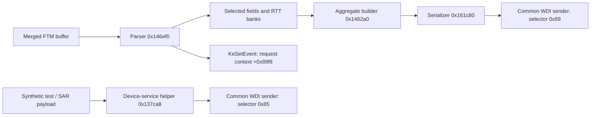

# FTM buffer, notification and TSF routing: exact-build static follow-up

This pass identifies the installed driver's actual device-service notification
helper and its direct callers. **The discovered notification routes carry synthetic
test data or a SAR request, while the traced FTM completion carries the already
aggregated result.** No connection from the complete FTM measurement buffer to
that notification helper was found in the bounded scopes below.

The result narrows an implementation question; it does not prove that every
possible vendor export route is absent. It also does not establish that FTM and
TSF use physically different clocks.

## Scope and reproducibility

Analysis date: 2026-10-03. Research checkout at the start of this pass:
`dd4a92a7988ab848f4672fdb045e71c099ccf809`.

The installed ARM64 `qcwlanhmt8380.sys` SHA-256 was recomputed as
`ca884ce1a22113194f3c467f36abc39afb0c137e5a7a8e2697420438b21e4115`.
All addresses are RVAs in that file. They are evidence locations, not supported
call targets. The analysis read the on-disk PE, saved disassembly, import table
and exception directory, and freshly disassembled selected ranges with installed
MSVC `dumpbin`. No driver function, private IOCTL, firmware request, memory-read
interface, debugger, tracing session or notification subscription was invoked.

The [raw-access report](ftm-raw-access-followup.md) already establishes the
aggregate public contract and the existence of a pre-aggregation buffer. This
report adds caller identification, the actual indication route, and the scope of
a misleadingly promising hex-dump call.

## A concrete device-service notification implementation

The diagnostic name `MpWdiIndicateDeviceServiceEvent` identifies the routine at
`0x137ca8`. Its implemented data path is:

| RVA | Observed behavior |
|---|---|
| `0x137cd0`–`0x137d4c` | Construct a 16-byte service GUID from incoming arguments and retain an opcode; this internal helper narrows its opcode argument to eight bits |
| `0x137d50`–`0x137e38` | Describe the optional caller-supplied byte buffer in chunks of `0xf000` bytes for serialization |
| `0x137e3c`–`0x137e54` | Call the serializer at `0x161aa0` with the service parameters |
| `0x137e94`–`0x137eb4` | Pass the generated message to the common `WdiSendIndication` routine at `0x13c430`, using internal message selector `0x85` |
| `0x137eb8`–`0x137ec8` | Release generated message and temporary descriptor storage |

This is positive evidence of a working implementation path in the image, not
evidence of its execution or delivery in this pass. The internal helper's argument
layout and selector are not a new userspace API. In particular, its opcode
narrowing must not be generalized to Microsoft's public DWORD opcode contract.

Microsoft's documented device-service indication carries a service GUID, opcode
and optional vendor blob. Its documented power/port restrictions also mean that
an otherwise valid indication need not reach a subscriber in every state. See
[device-service indication](https://learn.microsoft.com/en-us/windows-hardware/drivers/network/ndis-status-wdi-indication-device-service-event).

### Its three direct callers

A scan of aligned AArch64 `B`/`BL` instructions in all executable PE sections found
three direct branches to `0x137ca8`. These agree with the saved disassembly, and
each caller was freshly inspected:

| Call site | Payload origin | What this establishes |
|---|---|---|
| `0x12193c` | A diagnostic test branch supplies zero length and a null pointer | An empty test notification route |
| `0x1219ac` | The same test branch allocates a selected length and fills bytes with an incrementing pattern | Synthetic payload transport, not a measurement export |
| `0x152e48` | `sar2GenerateUnsolicitRequest` at `0x152de0` supplies one stack byte with value 1, length 1 and opcode 1 | A SAR notification route, not raw FTM data |

The SAR routine's address is passed to a scheduling helper at `0x152ef4`–`0x152f08`.
The test and SAR callers use different fixed service GUIDs, both found in the
previously inspected service list. The complete FTM buffer is not an input to
any of these three calls. No test branch or SAR operation was executed.

No absolute 64-bit pointer equal to the notifier's image address was found in the
on-disk file. This is supporting search evidence only: computed addresses,
relative references, wrappers and runtime tables can evade such a search.

## FTM follows an aggregation completion route

The complete merged measurement parser at `0x146ef0` terminates its successful
path by signaling the event at request-context offset `0x89f8`
(`0x14755c`–`0x147574`). Import-table resolution identifies the indirect target as
`ntoskrnl!KeSetEvent`; it is not an unidentified notification callback.

The FTM wait-state routine at `0x145240` resets that same event and waits on it
alongside another event. The imports resolve to `KeResetEvent` and
`KeWaitForMultipleObjects`. These are host synchronization objects, not
hardware timestamp counters or sampling fences.

Separately, the FTM task handler calls completion routine `0x13c310` at
`0x1335dc`. That routine has a directly visible output path:

At `0x13c34c` the completion routine invokes the aggregate builder; at `0x13c368`
it serializes the result; at `0x13c3f0`–`0x13c3f8` it sends selector `0x89`.
This is a concrete distinction between the two output paths. A shared final WDI
sender does not imply that the device-service route receives the raw FTM input.
The diagram shows data products and the separate signal; it does not claim the
entire asynchronous state machine has been exhaustively reconstructed.

## The extra hex dump is location information

The merged parser calls `parse_peer_ap` at `0x1475b0` before entering the
per-frame loop. That helper has a raw-looking call at `0x1476ac` to `0x15a100`.
The latter formats successive input bytes as hexadecimal and logs them, so this
was a plausible candidate for previously overlooked raw timestamp data.

Tracing its arguments resolves the ambiguity. The helper validates a TLV with
tag `0x12`, derives the length from that TLV, and passes the current peer-side TLV
pointer and length to the dump function. Its diagnostic label identifies LCI
printing. It advances the cursor past that TLV before the merged parser reaches
the 64-byte `0x2b` frame records. This call therefore dumps the location-information
region, not the complete measurement response or the per-frame opaque bytes
at offsets `+0x08..+0x17`.

This conclusion is scoped to this caller and valid record traversal. The generic
hex-dump routine has other callers; their existence does not identify their data
as FTM timestamps. No proprietary bytes or hex dump are reproduced here.

## Separate IHV indication: bounded negative evidence

The driver recognizes an internal selector `0x5e` as `IHV_EVENT` in its diagnostic
name mapping at `0x13cc58`–`0x13ccb4`. Microsoft distinguishes this indication,
which targets an IHV extensibility module, from device-service notifications
delivered to registered clients. See
[IHV indication](https://learn.microsoft.com/en-us/windows-hardware/drivers/network/ndis-status-wdi-indication-ihv-event).

The common sender has 48 direct branch references in executable sections. The
inspected direct call sites did not establish an FTM path using selector `0x5e`.
The variable-selector helper at `0x13b838` constructs only a 16-byte status message;
its two direct callers select `0x6a` and `0x6b`. Another initially unresolved
sender call at `0x57108` selects `0x40` or `0x65`.

These observations resolve the obvious direct-call candidates. They do not prove
the absence of every indirect IHV indication producer or another framework-level
output path. In particular, a diagnostic selector name alone establishes no
producer, payload schema or supported raw-data operation.

## What separates the inspected FTM and TSF paths

The FTM initialization code registers OEM response handler `0x1477f0` for firmware
event ID `0x27004` at `0x145eac`–`0x145ec0`. The TSF initialization registers handler
`0x216b00` for event ID `0x5005` at `0x21599c`–`0x2159b0`, using the same registration
helper at `0x16a078`.

Their exposed data transformations differ:

- FTM reduces two 32-bit per-frame delta operands to signed RTT and later
  aggregates selected samples. The completion and notification paths inspected
  here do not attach a TSF sample or a timer-conversion object to those records.
- The TSF report handler copies reported TSF/SoC/global-TSF words. Its examined
  callback at `0x216c30`–`0x216c48` receives a vdev byte and the low-word TSF-minus-SoC
  difference, rather than a full absolute event-time pair.

Different event IDs, host buffers and callbacks establish **separate host-visible
report contracts**. They do not establish different oscillators, independent
clock rates, a common epoch, synchronization, or a conversion between FTM event
time and TSF. The firmware's measurement producer and exact field semantics
remain the missing evidence. No rate or offset can be inferred from host routing
alone.

## Search coverage and next bounded work

The on-disk immediate-offset references to the merged-buffer pointer
(`context +0x8a48`) identified initialization (`0x145e60`), cleanup (`0x145d60`),
error parsing (`0x146d28`), measurement parsing (`0x146ef0`) and OEM fragment
assembly (`0x1477f0`). Their inspected calls did not pass that buffer to the
device-service notifier or common WDI sender. The measurement parser's direct
call inventory and resolved event-signaling import similarly expose no such
handoff. Immediate-offset searching is not alias analysis: accesses through a
derived subobject, differently constructed offset or unknown callback remain
outside this negative conclusion.

The useful next work is therefore specific:

1. Obtain the exact firmware/OEM measurement schema and supported diagnostic
   export, including the meaning of the opaque frame region, counter units,
   validity flags and exchange identity. The identified test notification is
   not a substitute raw-FTM operation and should not be invoked for that purpose.
2. If further static coverage is needed, audit the remaining aliases of the FTM
   context and firmware ingress before `0x1477f0`, then trace any confirmed raw
   payload export to its actual consumer. Do not promote literal-reference
   absence to whole-program reachability proof.
3. To relate timers, obtain producer-side evidence mapping FTM event values to
   TSF/SoC or an independently qualified common observation. More examination of
   the aggregate WDI response or notification subscription alone cannot supply
   that relationship.

Validation performed: exact driver SHA-256; PE import and exception-directory
inspection; independent executable-section branch decoding; saved-disassembly
cross-reference comparison; fresh bounded disassembly of the listed critical
functions; primary-source contract checks; Markdown/local-link checks. No new
code tests were needed for this report-only change. No live delivery, firmware
semantics, timing accuracy or new hardware capability was validated.
