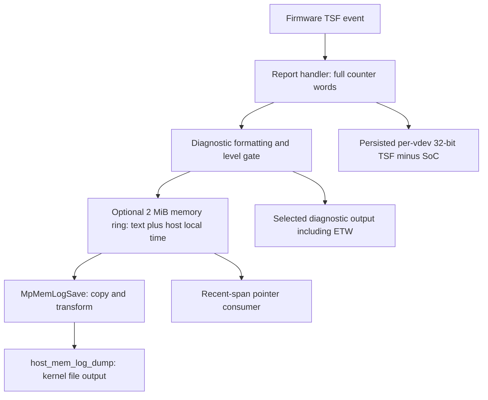

# Unmatched TSF reports and the host-memory log path

Status: offline follow-up on 2026-10-03, based on research revision
`8ba35c3c92d0ec2ee343dbc9044ad33e5fbb642c` plus the accompanying analysis changes.
The private campaign remains quarantined. No new trace, private request, firmware
command, device-memory access, adapter restart or clock change was performed.

Inputs are the finalized failed capture described in the
[campaign report](private-campaign-2026-10-03-quarantine.md) and the owned ARM64
driver 1.0.4374.1300, SHA-256
`ca884ce1a22113194f3c467f36abc39afb0c137e5a7a8e2697420438b21e4115`.
The SYS hash was recomputed before inspection. RVAs below apply only to that
image and are not callable userspace interfaces.

Subsequent results: [live passive validation, lifecycle dump consumers and scan
attribution lead](passive-and-retrieval-validation-2026-10-03.md).

## 1. The extra reports changed the previously cached SoC value

All nine requested action-3 report groups used the same SoC value. Both subsequent
unassigned groups changed it. All eleven global-TSF values were zero, and all
eleven delay words matched `(TSF - SoC) mod 2^32`.

| Transition | Driver report-log interval, ms | TSF signed change, raw ticks | SoC signed change, raw ticks | Recognized preceding command |
|---|---:|---:|---:|---|
| Report 8 to 9 | 3937.2915 | 3937118 | 0 | Action 3 |
| Report 9 to 10 | 1759.7818 | 1765682 | 305492927 | None |
| Report 10 to 11 | 511.4025 | 505357 | 511338 | None |

Host intervals use the saved trace's 10 MHz QPC frequency. Counter differences
remain raw signed integers; no tick conversion, wrap correction, epoch continuity
or sampling bracket is inferred. In particular, the large SoC change at report 10
is a transition away from a cached value, not a measured instantaneous clock rate.

The last two TSF and SoC increments differ by 5981 raw ticks. That rules out an
identical offset in those two reported pairs, but does not distinguish different
sampling instants, TSF adjustment, different counter behavior or other causes.
It is not a calibrated error or jitter bound.

Each extra report also has its own preceding `wmi_control_rx` TSF-event dispatch
in the saved context, with different buffer-pointer values (identities remain
private). Distinct buffers and values support separate deliveries. They do not
prove independent requests or reveal the initiator. Two reports about 511 ms
apart do not establish a periodic reporting mode.

The evidence weakens the hypothesis of a literal duplicate print of the ninth
report. It does **not** establish that action 4 occurred, that auto-report was
enabled, or that either pair was freshly and simultaneously sampled.

## 2. A bounded driver scan narrows the host command routes

The new `experiments/qualcomm/inspect_tsf_routes.py` validates the exact driver
hash, scans aligned words in four executable PE sections, and inventories
immediate B/BL targets and a MOVZ command constant. Code context was separately
checked against the retained disassembly.

| Evidence | Result |
|---|---|
| Direct calls to TSF builder `0x1955e8` | `0x18e990` from auto-report wrapper; `0x18ea14` from read/capture wrapper |
| Unshifted MOVZ of command `0x5012` | One match, `0x1956b8` |
| Builder's command log | Call at `0x1956b4`, before submission at `0x1956c8` |
| Direct calls to the two wrappers and report-handler entry | None found; their previously recovered registration uses runtime-constructed pointers |
| Aligned on-disk absolute pointers to the selected targets | None found |

This is not a complete call graph. Executable sections can contain data;
indirect calls, computed/encoded pointers, inlined builders and differently
synthesized constants remain outside this scan. Absence of a direct call is not
absence of a reachable route.

There is also an explicit limitation before ETW: the common logging helper at
`0x9360` compares the requested level against a global threshold at
`0x93b0`-`0x93bc`, and later chooses output paths at `0x9630`-`0x96b4`.
Both the command and report sites use this helper. No change of those controls
was observed or is claimed here. Their existence means zero ETW loss does not
prove every executed command emitted a diagnostic record in the first place.

## 3. A second copy exists before ETW: the host-memory ring

The same logger has a memory-ring path before its final output selection:



The ring is a concrete non-ETW retrieval lead. Its initialized state and current
contents have not been read, and no supported or private userspace retrieval
envelope is qualified by this result.

| Exact-build location | Established behavior |
|---|---|
| Logger `0x95e4`-`0x95ec` | For level zero, passes formatted message to writer `0x8b78` before final output routing |
| Initialization `0x8b18`-`0x8b34` | Allocates `0x200000` bytes; stores pointer and initialized flag |
| Data word `0x32e058` | On-disk capacity value 2097152 bytes |
| Writer `0x8bcc`-`0x8bdc` | Atomically reserves message length plus nine bytes **before** writing the record |
| Writer `0x8bf0`-`0x8c2c` | Prefix consists of marker byte and eight-byte host-time value |
| Import slot `0x2ed358`, call `0x8c18` | `ExSystemTimeToLocalTime`; this is not QPC or hardware time |
| Writer `0x8c30`-`0x8cec` | Copies prefix/text into ring with 21-bit wrap masking |
| Copy routine `0x8d20` (`MpMemLogSave`) | Allocates a copy, reads current reservation position and copies linear/wrapped ring data; invokes transform `0x8a20` |
| Transform `0x8a20` | Reversible bytewise XOR of the copied buffer; not a typed timestamp export |
| File consumer `0x230a50` (`host_mem_log_dump`) | Calls copy routine at `0x230b50`, uses `ZwCreateFile`/`ZwWriteFile`, then frees/closes resources |
| Direct file-consumer callers | `0x22e584` and `0x22e89c`, within broader diagnostic paths whose complete side effects remain unqualified |
| Recent-span helper `0x8a88` | Returns a pointer and bounded recent span; direct caller found at `0x2a5d4`; no userspace ABI established |

Microsoft documents `ExSystemTimeToLocalTime` as a conversion from system time
to time for the current local time zone. It supplies no hardware sampling
relationship. [Microsoft driver reference](https://learn.microsoft.com/en-us/windows-hardware/drivers/ddi/wdm/nf-wdm-exsystemtimetolocaltime).

There are practical constraints before this can be used:

- The producer advances its reservation position before copying. The inspected
  copy routine does not itself wait for each reserved record to finish. A copied
  position therefore cannot be assumed to delimit committed records during
  concurrent writes. Surrounding caller synchronization remains to be checked.
- Ring wrap and concurrent overwrites can remove or tear records. No stable
  per-record commit sequence or complete-snapshot contract was established.
- Text formatting retains the existing loss of request identity. A second copy
  of the log does not repair missing sampling semantics or missing event IDs.
- The file consumer is not a proven read-only IOCTL. It performs kernel file I/O
  and is reached from broader diagnostic paths. Do not trigger a dump/crash/reset
  path merely to retrieve timing data.
- No latency benefit has been measured. The ring precedes ETW in the inspected
  logger, but userspace retrieval costs, availability and interference are unknown.

## 4. Consequences for a usable clock and the next experiment

The current evidence supports a raw diagnostic observation capability only.
Changed values are not a freshness certificate, and successful report delivery
does not establish a hardware-to-host sampling bracket. Downstream
`userspace-clock` must retain independent qualification for observations,
conversion models and packet timestamps; no capability is promoted in this pass.

The next bounded investigation should:

1. Trace both `host_mem_log_dump` callers to their external trigger and enumerate
   the complete side effects. Stop at a diagnostic-only path unless an existing
   safe retrieval contract can be established. Determine caller synchronization
   around `MpMemLogSave` before designing a parser or polling loop.
2. Prepare a passive-only observation with predeclared duration, complete tail
   capture, lifecycle monitoring and exact identity checks. It can test whether
   unassigned reports recur without new private requests. Silence would bound
   only that observation window, not prove firmware drain or auto-report off.
3. Keep private admission disabled until the producer/association uncertainty is
   resolved or a separately reviewed acquisition method can tolerate it without
   fabricating request identity. Do not map the next observed report to the next
   request by order alone.

No enable/disable command, private getter, dump trigger or kernel hook is added
to the live allowlist. The current quarantine marker is unchanged.

## Reproduction and validation

Run from the repository root with the owned driver path and a fresh output name:

```powershell
python experiments/qualcomm/inspect_tsf_routes.py --driver '<owned exact-build SYS path>' --output artifacts/tsf-routes-new.json
python experiments/qualcomm/analyze_quarantined_tsf.py --capture artifacts/QualcommCampaign-0ca1b251e9b0/idle-read-3 --timing artifacts/QualcommCampaign-0ca1b251e9b0/idle-read-3/quarantine-offline.jsonl --output artifacts/tsf-counter-postmortem-new.json
python -m unittest discover -s tests -p test_tsf_routes.py -v
python -m unittest discover -s tests -p test_quarantined_tsf.py -v
```

The tools read disk files and require no elevation. Outputs are created
exclusively; exit 1 rejects input/I/O, exit 2 indicates CLI usage. They perform no
rollback because they change no device or firmware state. Keep capture inputs
and counter-level outputs private; the static output contains only hashes,
RVAs, import names and counts. The optional owned-driver test uses the existing
`WIFI_TIME_DRIVER_FIXTURE` environment variable and is skipped in hosted CI.

The route scanner reproduces instruction-target and import/capacity checks. It
does not automatically prove the manually reconstructed memory-ring semantics.
Those remain exact-build static findings tied to the RVAs above. Neither these
tests nor saved-trace replay constitute live qualification or calibrated accuracy.

Local validation in this pass: Python compilation and all 118 unit tests passed
with the owned driver fixture configured. Wrong-driver and existing-output CLI
checks both returned exit 1 without creating/overwriting an output. Both analysis
CLIs passed help checks; relative documentation links and `git diff --check`
passed. The quarantine marker retained its SHA-256
`69303899d4614d707cd9d3c6b915922acd4e0e53404b505340df5c2eb1216610`.
The final documented identity query found Wi-Fi Up with the same device identity,
driver version and driver hash. No new hosted-CI or live-acquisition result is
claimed for these working-tree changes.
