# Wi-Fi timer reports and private driver paths

Can the Wi-Fi timer become a usable clock source? The inspected private path delivers counter reports through Windows diagnostics and feeds transmit-delay statistics. It has not established simultaneous sampling, a calibrated host-clock conversion, or a safe fast getter. Later acquisition findings keep private collection quarantined pending further qualification.

TSF (Timing Synchronization Function) is the Wi-Fi timer. SoC means system on chip; QPC is the Windows host counter. ETW is Windows event tracing, whose log time differs from the hardware sampling time. See the [glossary](../glossary.md).

## Report and related evidence

- [private-tsf-fast-paths.md](private-tsf-fast-paths.md): can automatic reports or private statistics expose full counters, and what shared state would they change?
- [Qualcomm adapter evidence](../adapters/qualcomm.md): what did the original exact-build requests and reports show?
- [Later scan comparison](../acquisition/scan-tsf-results-2026-10-03.md): why does private acquisition remain quarantined?
- [Packet-to-clock map](../clock-models/packet-to-clock-map.md): where do these observations fit in packet and clock processing?

## Observed report route and limits

The diagram describes the recorded experiment, not a currently qualified acquisition recipe. Source: [qualcomm-timestamp-path.mmd](diagrams/qualcomm-timestamp-path.mmd).

```mermaid
flowchart LR
  A["Sampler: host request-start QPC"] -->|private request| B["Observed: guarded QcomWifi request"]
  B -->|command 0x5012| C["Observed: action 3 READ / action 4 CAPTURE"]
  C -->|counter report| D(["Unqualified: TSF / SoC sampling instant"])
  D -->|event 0x5005| E["Observed: firmware report"]
  E -->|driver logging| F["Observed: ETW log time uses host QPC"]
  F -->|ETW delivery| G["Observed: reader delivery delay<br/>about 1.6 seconds median"]
  G -->|decode and validate| H["Recorded: action, identity, epoch, report age"]
  B -. "IOCTL completion: around 54 us median; no counter tuple" .-> A
  A -. "request-start to report log: about 0.27 ms median" .-> F
  D -. "qualification limit" .-> U(["Unqualified pairing: action 3 SoC cached or unknown;<br/>action 4 refreshed, atomicity unproven"])
  H -. "qualification limit" .-> X(["Unqualified: calibrated TSF-QPC conversion"])
  classDef gap fill:#fff2dd,stroke:#ac6b12,color:#241b0e;
  classDef seen fill:#e8f5ed,stroke:#34704a,color:#193323;
  class D,U,X gap;
  class B,C,E,F,G,H seen;
```

Diagram key: solid arrows show request or data flow. Dashed arrows show host timing observations or a qualification limit, as labeled. Rectangles identify process steps or recorded observations; rounded nodes explicitly mark unqualified clock claims. Color is supplementary. The reported medians describe that experiment, not latency guarantees or physical accuracy.

## Research tools

- [qualcomm_protocol.py](../../research/tsf/qualcomm_protocol.py): exact-build guards and request layout.
- [qualcomm_probe.py](../../research/tsf/qualcomm_probe.py): private request research entry point.
- [Capture-TsfReport.ps1](../../research/tsf/Capture-TsfReport.ps1) and [decode_tsf_etl.c](../../research/tsf/decode_tsf_etl.c): report capture and saved-trace decoding.
- [Capture-LatchExperiment.ps1](../../research/tsf/Capture-LatchExperiment.ps1) and [analyze_latch.py](../../research/tsf/analyze_latch.py): action-3/action-4 experiment and analysis.
- [analyze_tsf_series.py](../../research/tsf/analyze_tsf_series.py): saved report-series analysis.
- [inspect_tsf_routes.py](../../research/tsf/inspect_tsf_routes.py): static route inspection.

Tool presence does not override the acquisition restrictions or establish a sampling contract. Return to the [documentation index](../README.md).
