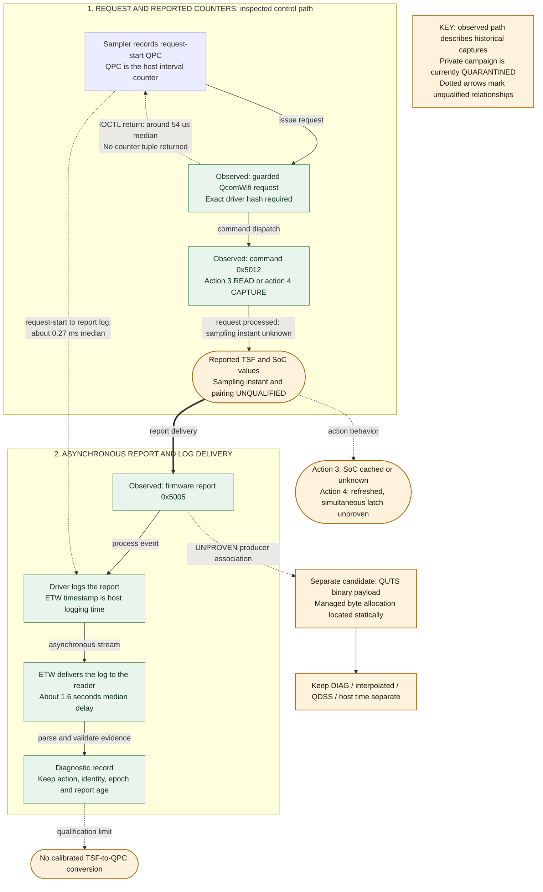

# Wi-Fi timer reports and private driver paths

Can the Wi-Fi timer become a usable clock source? The inspected private path delivers counter reports through Windows diagnostics and feeds transmit-delay statistics. It has not established simultaneous sampling, a calibrated host-clock conversion, or a safe fast getter. Later acquisition findings keep private collection quarantined pending further qualification.

<!-- current-context:2026-10-04 -->
**Current context (2026-10-04):** The TSF sampling and response-association contract remains open. New diagnostic return interfaces do not automatically qualify a fresh TSF getter. See [current findings](../knowledge/current-findings.md).
<!-- /current-context -->

TSF (Timing Synchronization Function) is the Wi-Fi timer. SoC means system on chip; QPC is the Windows host counter. ETW is Windows event tracing, whose log time differs from the hardware sampling time. See the [glossary](../glossary.md).

## Report and related evidence

- [Receive-buffer producer before HTC](hif-receive-buffer-producer.md): posted pooled buffers, CE completion identity, HIF queue handoff and two proposed owned-copy points.
- [Original TSF event, normalization and owned copy](tsf-event-ingress-and-owned-copy.md): where the received length survives, how the decoder borrows or pads data, and the exact callback cleanup boundary.
- [Action-4 completion and complete-report contract](action4-completion-and-report-contract.md): transport success can leave work queued; exact-build inspection and owned diagnostic decoding preserve that distinction.
- [Autonomous management-frame TSF](autonomous-management-tsf.md): offline beacon/probe decoding with separate peer-clock and event identity.
- [Association, fresh sampling and quarantine disposition](tsf-association-and-quarantine-disposition.md): omitted report metadata, a reference-layout lead and the reviewed retain-quarantine decision.
- [Saved TSF reader API](tsf-evidence-reader.md): implemented diagnostic replay, owned copies and explicit clock-input rejection.
- [Required TSF readout in the implementation plan](../overview/2026-10-03-first-hardware-clock-plan.md#required-tsf-readout): value/source, freshness, ownership, continuity and the separate TSF-to-QPC gate.
- [private-tsf-fast-paths.md](private-tsf-fast-paths.md): can automatic reports or private statistics expose full counters, and what shared state would they change?
- [Qualcomm adapter evidence](../adapters/qualcomm.md): what did the original exact-build requests and reports show?
- [Later scan comparison](../acquisition/scan-tsf-results-2026-10-03.md): why does private acquisition remain quarantined?
- [Packet-to-clock map](../clock-models/packet-to-clock-map.md): where do these observations fit in packet and clock processing?

## Observed report route and limits

The diagram describes the recorded experiment, not a currently qualified acquisition recipe. Source: [qualcomm-timestamp-path.mmd](diagrams/qualcomm-timestamp-path.mmd).

Diagram key: solid arrows show request or data flow. Dashed arrows show host timing observations or a qualification limit, as labeled. Rectangles identify process steps or recorded observations; rounded nodes explicitly mark unqualified clock claims. Color is supplementary. The reported medians describe that experiment, not latency guarantees or physical accuracy.

## Research tools

- [qualcomm_protocol.py](../../research/tsf/qualcomm_protocol.py): exact-build guards and request layout.
- [qualcomm_probe.py](../../research/tsf/qualcomm_probe.py): private request research entry point.
- [Capture-TsfReport.ps1](../../research/tsf/Capture-TsfReport.ps1) and [decode_tsf_etl.c](../../research/tsf/decode_tsf_etl.c): report capture and saved-trace decoding.
- [Capture-LatchExperiment.ps1](../../research/tsf/Capture-LatchExperiment.ps1) and [analyze_latch.py](../../research/tsf/analyze_latch.py): action-3/action-4 experiment and analysis.
- [analyze_tsf_series.py](../../research/tsf/analyze_tsf_series.py): saved report-series analysis.
- [inspect_tsf_routes.py](../../research/tsf/inspect_tsf_routes.py): static route inspection.

Tool presence does not override the acquisition restrictions or establish a sampling contract. Return to the [documentation index](../README.md).
